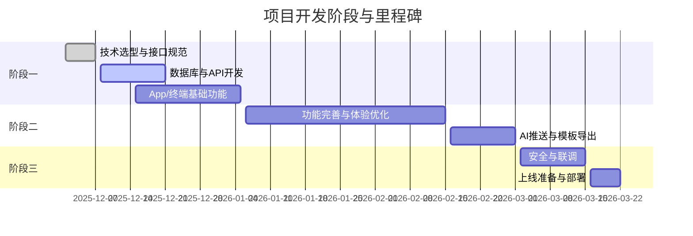

# 项目开发计划（详细分解与约定）

## 一、项目整体开发流程与阶段划分（详细）

### 阶段一：基础架构与核心功能开发
- 目标细化：
  - 明确三端技术选型，输出详细接口规范文档。
  - 完成数据库结构设计，ER 图及字段定义评审。
  - 服务器端实现用户注册/登录、设备绑定、消息基础 API，接口需通过 Postman/自动化测试。
  - App 端实现注册/登录、设备绑定、基础资料管理，UI/UX 需初步可用。
  - 物理终端完成 BLE 通信协议初版，支持设备发现、配对、基础消息收发。
  - 服务器端集成第三方语音转写服务，消息同步流程打通。
- 关键节点约定：
  - 技术选型评审会，接口规范冻结。
  - 数据库结构评审会，ER 图定稿。
  - 三端基础功能联调通过，形成阶段性演示版本。
- 交付物：
  - 技术选型与接口规范文档
  - 数据库结构文档与 ER 图
  - 三端基础功能代码与联调报告
- 验收标准：
  - 主要功能可用，接口联调通过，数据库结构无重大缺陷。

### 阶段二：功能完善与体验优化
- 目标细化：
  - App 端完善个人资料、隐私设置、消息管理、语音输入，UI/UX 迭代。
  - 物理终端实现显示、发光、语音本地识别、预设语音导引等功能。
  - 服务器端上线 AI 运算、宇宙传讯推送、消息推送等模块。
  - 设计信息输出模板，支持导出/打印。
- 关键节点约定：
  - App/终端功能评审会，体验优化建议收集。
  - AI 推送与模板导出功能上线评测。
- 交付物：
  - 完善功能的 App/终端/服务器端代码
  - AI 推送模块、导出模板
  - 体验优化报告
- 验收标准：
  - 功能完整，体验流畅，AI 推送与导出可用。

### 阶段三：安全、性能与多端联调
- 目标细化：
  - 完善密码管理、黑名单、冷却机制等安全功能。
  - 多端联调，完成压力测试与性能优化。
  - 完善文档与用户协议，准备上线部署。
- 关键节点约定：
  - 安全机制评审会，联调与性能测试报告评审。
  - 上线准备会议，部署流程演练。
- 交付物：
  - 安全机制代码与测试报告
  - 联调与性能测试报告
  - 上线部署文档
- 验收标准：
  - 安全无重大漏洞，联调与性能测试通过，部署流程顺畅。

---

## 二、各阶段主要任务、目标、交付物及验收标准（细化）

| 阶段   | 主要任务                                                         | 交付物                                   | 验收标准                                   |
| ------ | --------------------------------------------------------------- | ---------------------------------------- | ------------------------------------------ |
| 阶段一 | 技术选型、接口规范、数据库设计、三端基础功能开发                 | 技术文档、数据库结构、API 文档、三端基础功能 | 主要功能可用，接口联调通过，数据库结构无重大缺陷 |
| 阶段二 | 功能完善、体验优化、AI 推送、模板导出                           | 完善功能的 App/终端/服务器、AI 推送模块、导出模板 | 功能完整，体验流畅，AI 推送与导出可用           |
| 阶段三 | 安全加固、多端联调、性能优化、上线准备                           | 安全机制、联调报告、性能测试报告、上线部署文档 | 安全无重大漏洞，联调与性能测试通过，部署流程顺畅 |

---

## 三、各端协作方式与接口对接流程（详细约定）

### 1. App 端
- 与服务器端：
  - 采用 HTTPS/RESTful API，所有接口需统一鉴权（如 JWT）。
  - WebSocket 用于实时消息推送，需心跳包与断线重连机制。
  - 接口文档需用 OpenAPI/Swagger 规范，前后端定期联调。
- 与物理终端：
  - 采用 BLE，约定服务 UUID、特征 UUID，数据包格式（如 TLV/JSON）。
  - 设备发现、配对流程需有超时与重试机制，配对码加密传输。
  - 数据同步采用队列机制，防止丢包与乱序。
  - 蓝牙协议需支持扩展字段，兼容后续功能升级。
- 主要接口：
  - 用户注册/登录、设备绑定/解绑、消息收发、资料管理、蓝牙数据交互。

### 2. 物理终端
- 与 App 端：
  - BLE 通信，严格遵循协议约定，支持 OTA 升级。
  - 消息下发/回传、控制指令（如发光、显示、语音采集）需有 ACK 机制。
  - 设备状态与异常需主动上报，支持日志回传。
- 与服务器端：
  - MQTT/HTTP 通信用于远程升级、日志上传等，需鉴权与加密。
- 主要功能：
  - 消息显示、发光控制、语音采集与本地识别、设备状态上报。

### 3. 服务器端
- 对外接口：
  - RESTful API、WebSocket，接口需统一鉴权与限流。
  - 支持消息同步、转写、推送、AI 运算等。
- 与 App、物理终端：
  - 保持接口兼容，定期联调，接口变更需提前通知。
- 其他约定：
  - 日志与异常监控，接口调用链追踪，支持灰度发布。

#### 蓝牙协议设计要点（详细约定）
- 设备发现与配对：采用标准 BLE 广播，配对码加密，支持多设备管理。
- 消息下发与回传：数据包格式统一，字段含类型、内容、时间戳、校验码，支持分包与重组。
- 控制指令：如发光、显示、语音采集等，指令格式需有类型、参数、响应码，支持批量下发。
- 设备状态同步与异常上报：状态码、错误码标准化，支持扩展。
- 安全机制：配对码动态生成，数据加密（如 AES），防止中间人攻击。

---

## 四、技术选型、架构原则、代码规范、测试与部署要求（细化）

### 技术选型
- 服务器端：Python（FastAPI/Celery），RESTful API，WebSocket，Docker 部署，日志与监控用 Prometheus/Grafana。
- App 端：Flutter（Dart），BLE 插件统一封装，UI 组件库选型（如 Material/Cupertino）。
- 物理终端：C/C++/MicroPython，BLE 通信栈，MQTT/HTTP 客户端，支持 OTA。
- 数据库：PostgreSQL/MySQL，日志与消息可用 Redis 缓存。
- 持续集成：GitHub Actions + Docker，自动化测试与部署。

### 架构原则
- 分层解耦：表现层、业务层、数据层分离，接口清晰。
- 统一认证与权限管理：OAuth2/JWT，细粒度权限控制。
- 日志与异常监控：全链路日志，异常自动告警。
- 横向扩展与高可用：微服务可选，支持负载均衡与容灾。

### 代码规范
- 服务器端：PEP8，接口文档自动生成，单元测试覆盖率 ≥ 80%。
- App 端：Effective Dart，组件化开发，代码注释与文档齐全。
- 物理终端：MISRA C，代码静态检查，关键路径冗余校验。
- 统一接口文档：OpenAPI/Swagger，接口变更需版本管理。
- 代码审查与自动化检查：CI 强制执行，PR 必须通过自动测试。

### 测试与部署
- 单元测试：各端关键模块均需覆盖。
- 集成测试：接口联调、端到端流程测试。
- 自动化部署：脚本化部署，支持回滚。
- 灰度发布：分批上线，监控异常自动回滚。
- 监控告警：Prometheus/Grafana，异常自动通知。

---

## 五、风险点与应对措施（细化）

| 风险点                 | 影响                   | 应对措施                                                         |
| ---------------------- | ---------------------- | ---------------------------------------------------------------- |
| 蓝牙协议兼容性与稳定性 | 影响设备通信与体验     | 协议提前设计，主流机型充分测试，协议预留扩展，异常自动重连与日志 |
| 多端数据同步延迟       | 影响用户体验           | 引入消息队列与缓存，优化同步机制，关键路径加重试与告警           |
| AI/语音服务稳定性      | 影响核心功能           | 采用成熟云服务，关键路径降级，接口超时与异常处理                 |
| 安全漏洞（认证、数据泄露） | 影响系统安全         | 严格权限校验，数据加密，定期安全审计，接口限流                   |
| 终端硬件适配与固件升级 | 影响设备可用性         | 远程升级机制，日志回传，硬件选型标准化，固件版本管理             |
| 需求变更与进度风险     | 影响交付               | 敏捷开发，阶段性评审，需求变更流程化，及时调整计划               |

---

## 六、数据库结构设计（简要 ER）

详见 doc/TODO.md，建议后续用 ER 图工具完善，字段与表结构变更需评审与版本管理。

---

## 七、里程碑与关键节点示意图

---

> 本开发计划为项目技术实施的详细指导文档，所有约定如有变更需评审与记录，后续可根据实际进展动态调整。