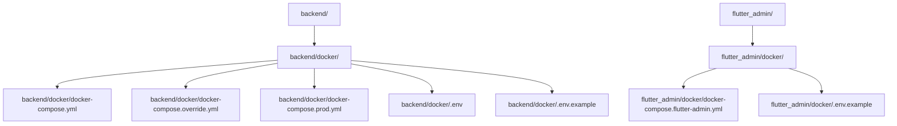

# Docker 配置拆分与目录优化建议

## 1. 文件用途梳理
- `.env`、`.env.example`：全局环境变量，主要用于后端服务（如数据库、管理员账号等），部分变量也被 celery/worker 使用。
- `docker-compose.yml`、`docker-compose.override.yml`、`docker-compose.prod.yml`：主要用于后端（backend）及依赖服务（db、redis、celery），涉及后端开发、测试、生产部署。
- `docker-compose.flutter-admin.yml`：仅用于前端 flutter_admin 镜像部署。

## 2. 拆分建议
- 后端相关 compose 文件（如 `docker-compose.yml`、`docker-compose.override.yml`、`docker-compose.prod.yml`）及 `.env` 文件迁移至 [`backend/docker/`](backend/docker/) 目录。
- 前端相关 compose 文件（如 `docker-compose.flutter-admin.yml`）迁移至 [`flutter_admin/docker/`](flutter_admin/docker/) 目录。
- `.env.example` 可分别在前后端目录各保留一份模板，内容按实际需要拆分。
- 若有全局网络/卷声明，可保留一个顶层 `docker/` 目录仅存放全局网络/卷声明模板（如有需要）。

## 3. 新目录结构示意

## 4. 协作与维护建议
- 各自服务的 Docker 配置归属到对应目录，便于团队分工、权限控制和独立开发。
- 全局变量（如网络、卷）如需统一管理，可在顶层 `docker/` 目录保留模板或文档说明。
- `.env` 文件避免提交敏感信息，仅 `.env.example` 作为模板纳入版本控制。
- 文档需同步更新，说明各 compose 文件的用途及启动方式。

---
如需进一步细化迁移步骤或自动化脚本，可补充说明。